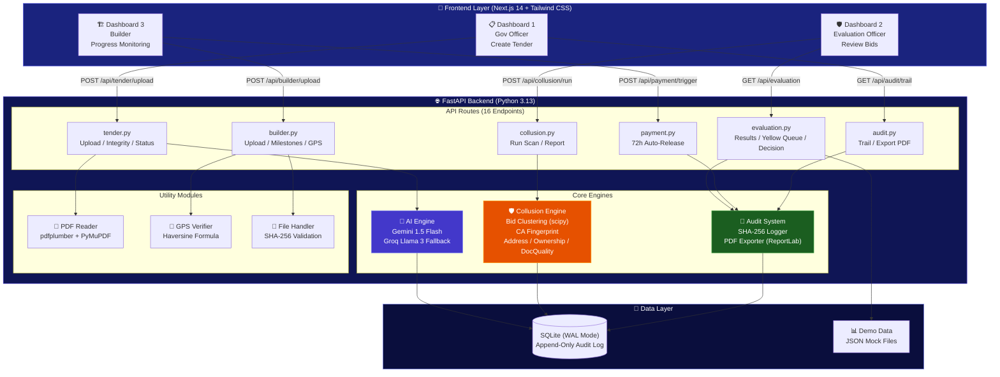
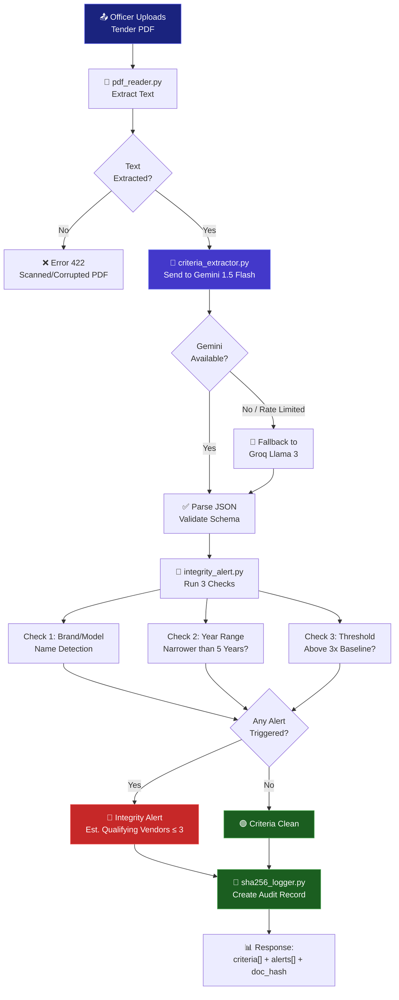
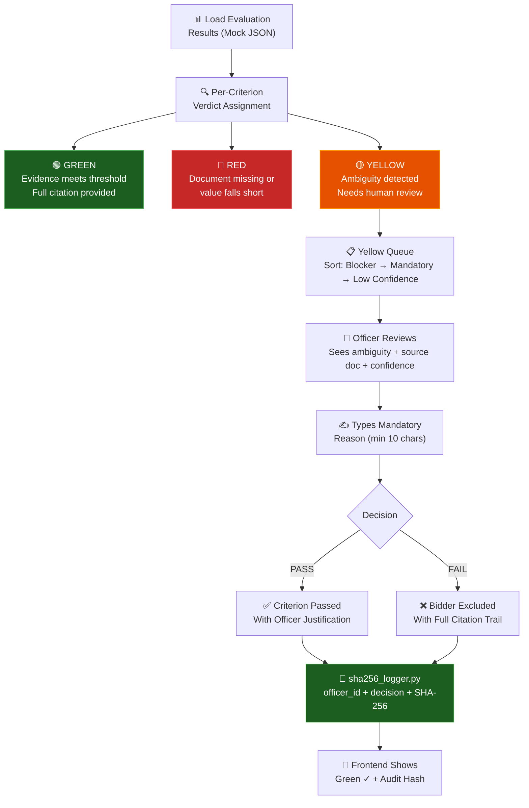
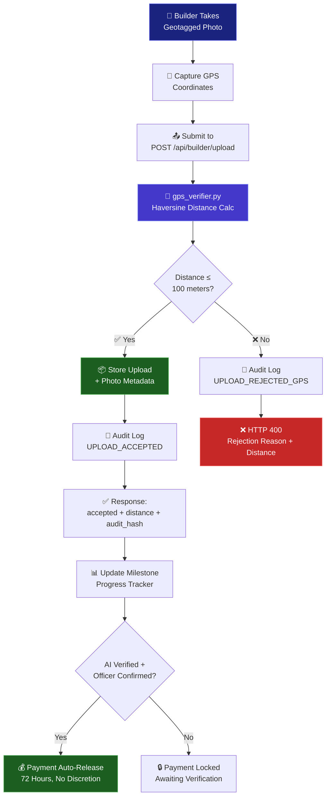
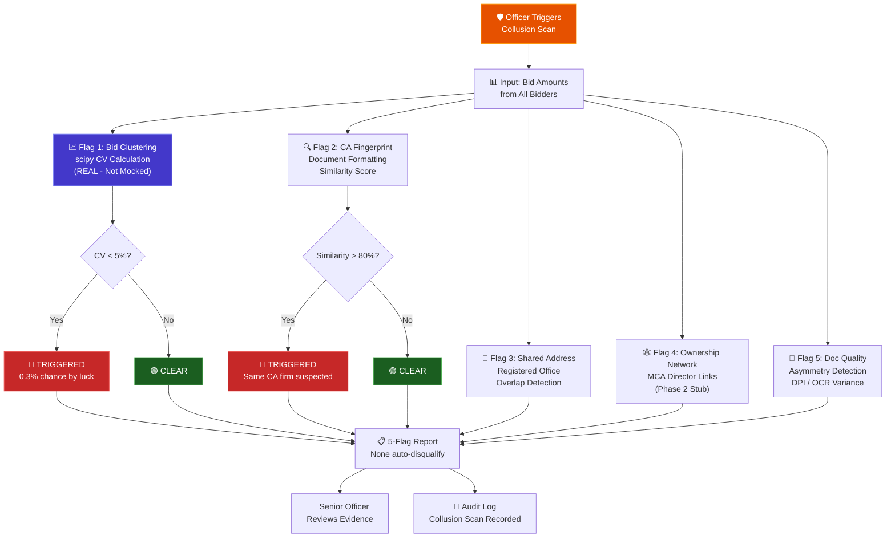
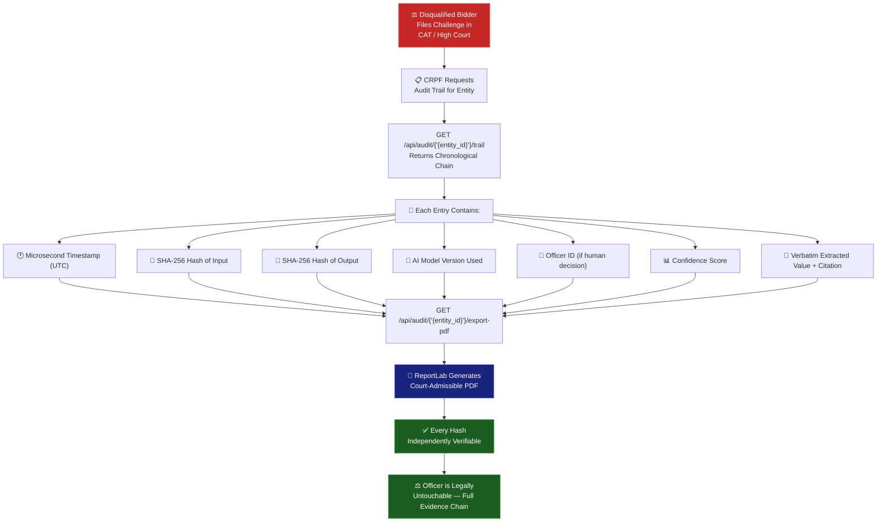

<p align="center">
  
</p>

<h1 align="center">Nyayadarsi — AI-Powered Procurement Justice</h1>
<h3 align="center">न्यायदर्शी — One who sees justice</h3>

<p align="center">
  <em>AI that makes government procurement corruption visible at the moment it is attempted — before any money moves.</em>
</p>

<p align="center">
  
  
  
  
</p>

<p align="center">
  
  
  
  
  
  
</p>

---

## 📌 The Problem

Indian government procurement corruption enters at **five specific points**. Nyayadarsi closes all five.

| # | Corruption Point | How It Works | Nyayadarsi's Response |
|---|------------------|--------------|----------------------|
| 1 | **L1 Trap** | Tender criteria engineered so only one vendor qualifies | Real-time **Integrity Alerts** before tender publication |
| 2 | **Document Fraud** | Forged certificates pass manual evaluation | AI-powered **document verification** with GREEN/YELLOW/RED verdicts |
| 3 | **Cartel Bidding** | Shell companies simulate competition with near-identical bids | **Collusion Risk Engine** — bid clustering, CA fingerprint, address overlap |
| 4 | **Ghost Work** | Bills cleared for work never completed | **GPS-verified** daily uploads with AI progress estimation |
| 5 | **Payment Extortion** | Commissions extracted at every payment stage | **72-hour auto-release** — zero officer timing discretion |

---

## 🏗️ System Architecture



---

## 🔄 Core Workflows

### Flow 1 — Tender Upload → AI Extraction → Integrity Alerts



### Flow 2 — Bidder Evaluation → Officer Decision → Audit



### Flow 3 — Builder GPS Upload → Accept / Reject



### Flow 4 — Collusion Risk Scan (5-Flag Analysis)



### Flow 5 — Audit Trail → Court-Admissible PDF Export



---

## 📁 Project Structure

```
nyayadarsi/
│
├── 📄 .env.example                    # Environment variable template
├── 📄 .gitignore                      # Git exclusions
├── 📄 README.md                       # This file
├── 📄 worktillnow.md                  # Team progress tracker
│
├── 🔧 backend/                        # FastAPI + Python 3.13
│   ├── __init__.py
│   ├── main.py                        # App entry — mounts routers, CORS, health check
│   ├── config.py                      # Loads .env — API keys, GPS coords, thresholds
│   ├── database.py                    # SQLite + WAL — 6 tables, init_db()
│   ├── requirements.txt               # Python dependencies
│   │
│   ├── 🤖 ai/                         # AI Pipeline
│   │   ├── gemini_client.py           # Gemini 1.5 Flash — rate-limit retry
│   │   ├── groq_client.py             # Groq Llama 3 — seamless fallback
│   │   ├── criteria_extractor.py      # Tender text → structured criteria JSON
│   │   ├── integrity_alert.py         # Rule-based alert engine (brand, year, threshold)
│   │   ├── value_extractor.py         # Document value extraction (Phase 2)
│   │   ├── financial_ontology.py      # "Annual Turnover" ↔ "Net Revenue" mapping
│   │   └── consistency_checker.py     # Cross-document financial verification
│   │
│   ├── 🛡️ collusion/                  # Collusion Risk Engine
│   │   ├── bid_clustering.py          # scipy CV analysis — REAL calculation
│   │   ├── ca_fingerprint.py          # Document formatting similarity
│   │   ├── address_flag.py            # Shared registered office detection
│   │   ├── ownership_network.py       # MCA director links (Phase 2 stub)
│   │   └── doc_quality.py             # Quality asymmetry detection
│   │
│   ├── 🔐 audit/                      # Cryptographic Audit System
│   │   ├── sha256_logger.py           # SHA-256 hashing, append-only INSERT
│   │   └── pdf_exporter.py            # Court-admissible PDF (ReportLab)
│   │
│   ├── 🌐 routes/                     # API Endpoints (16 total)
│   │   ├── tender.py                  # POST /upload, POST /integrity-check, GET /status
│   │   ├── evaluation.py              # GET /results, GET /yellow-queue, POST /officer-decision
│   │   ├── collusion.py               # POST /run, GET /report
│   │   ├── builder.py                 # POST /upload, GET /milestones, POST /verify-gps
│   │   ├── payment.py                 # POST /trigger (72h auto-release)
│   │   └── audit.py                   # GET /trail, GET /all, GET /export-pdf
│   │
│   ├── 🛠️ utils/                      # Utility Modules
│   │   ├── pdf_reader.py              # pdfplumber → PyMuPDF fallback
│   │   ├── gps_verifier.py            # Haversine formula — 100m threshold
│   │   └── file_handler.py            # Upload validation + SHA-256
│   │
│   └── 📋 models/                     # Pydantic Schemas
│       ├── tender.py                  # TenderCreate, TenderCriterion, IntegrityAlertResponse
│       ├── bidder.py                  # BidderProfile, DocumentUpload, BidderSubmission
│       ├── evaluation.py              # Verdict (GREEN/YELLOW/RED), CriterionResult
│       └── builder.py                 # BuilderUpload, GPSData, PaymentTrigger
│
├── 🎨 frontend/                       # Next.js 14 + Tailwind CSS
│   ├── package.json
│   ├── next.config.js                 # API proxy to FastAPI backend
│   ├── tailwind.config.js             # Custom palette, verdict colors, animations
│   ├── postcss.config.js
│   ├── .env.local                     # NEXT_PUBLIC_API_URL
│   │
│   ├── styles/
│   │   └── globals.css                # Glassmorphism, micro-animations, verdict badges
│   │
│   ├── pages/
│   │   ├── _app.js                    # Root wrapper — SEO meta, global styles
│   │   ├── index.js                   # Landing — animated logo, 3 dashboard cards
│   │   ├── gov.js                     # Dashboard 1 — tender upload, AI extraction, alerts
│   │   ├── evaluation.js              # Dashboard 2 — bidder verdicts, yellow queue, collusion
│   │   └── builder.js                 # Dashboard 3 — GPS upload, milestones, payments
│   │
│   ├── components/
│   │   └── layout/
│   │       └── Layout.jsx             # Sidebar + top bar — used by all dashboards
│   │
│   └── lib/
│       ├── api.js                     # All fetch calls — consistent {data, error} shape
│       └── constants.js               # Branding, verdict colors, nav items, flag labels
│
├── 📊 demo/                           # Demo Data & Samples
│   ├── sample_tender_text.txt         # CRPF barracks tender with narrow criteria
│   └── mock_data/
│       ├── evaluation_results.json    # 4 bidders — GREEN, RED, YELLOW verdicts
│       ├── collusion_results.json     # 5 flags — bid clustering + CA fingerprint triggered
│       ├── bids.json                  # 4 bid amounts for clustering analysis
│       ├── milestones.json            # 5 construction milestones
│       └── audit_trail.json           # Sample audit entries with SHA-256 hashes
│
└── ⚙️ scripts/                        # Setup & Utilities
    ├── setup.bat                      # Windows one-click setup
    ├── seed_demo.py                   # Load mock data into SQLite
    └── test_gemini.py                 # Validate API key before demo
```

---

## 🚀 Quick Start

### Prerequisites

- Python 3.11+ (tested with 3.13)
- Node.js 18+
- Gemini API Key ([get free key](https://aistudio.google.com/app/apikey))

### 1. Clone & Configure

```bash
git clone https://github.com/SIBAM890/Nyayadarsi.git
cd Nyayadarsi

# Create .env from template
copy .env.example .env
# Edit .env → add your GEMINI_API_KEY
```

### 2. Backend Setup

```bash
cd backend
python -m venv venv
venv\Scripts\activate              # Windows
pip install -r requirements.txt

# Initialize database + seed demo data
cd ..
python scripts/seed_demo.py
```

### 3. Frontend Setup

```bash
cd frontend
npm install
```

### 4. Run

```bash
# Terminal 1 — Backend (from project root)
cd Nyayadarsi
python -m uvicorn backend.main:app --reload --host 0.0.0.0 --port 8000

# Terminal 2 — Frontend
cd frontend
npm run dev
```

| Service | URL |
|---------|-----|
| Frontend | http://localhost:3000 |
| Backend API | http://localhost:8000 |
| API Docs (Swagger) | http://localhost:8000/docs |
| API Docs (ReDoc) | http://localhost:8000/redoc |

### 5. Verify

```bash
# Test API health
curl http://localhost:8000/api/health

# Test AI connection
python scripts/test_gemini.py
```

---

## 📡 API Reference

### Tender Management

| Method | Endpoint | Description |
|--------|----------|-------------|
| `POST` | `/api/tender/upload` | Upload tender PDF → Gemini extracts criteria → integrity alerts |
| `POST` | `/api/tender/integrity-check` | Check a single criterion for alerts |
| `GET` | `/api/tender/{tender_id}/status` | Get tender evaluation progress |

### Bid Evaluation

| Method | Endpoint | Description |
|--------|----------|-------------|
| `GET` | `/api/evaluation/{tender_id}/results` | All bidder evaluations (GREEN/YELLOW/RED) |
| `GET` | `/api/evaluation/{tender_id}/yellow-queue` | Pending YELLOW items, sorted by consequence |
| `POST` | `/api/evaluation/officer-decision` | Record officer PASS/FAIL with mandatory reason |

### Collusion Detection

| Method | Endpoint | Description |
|--------|----------|-------------|
| `POST` | `/api/collusion/run` | Run 5-flag collusion analysis (real scipy) |
| `GET` | `/api/collusion/{tender_id}/report` | Retrieve stored collusion report |

### Builder Monitoring

| Method | Endpoint | Description |
|--------|----------|-------------|
| `POST` | `/api/builder/upload` | GPS-verified progress upload (rejects if >100m) |
| `GET` | `/api/builder/{contract_id}/milestones` | Milestone progress and payment status |
| `POST` | `/api/builder/verify-gps` | Standalone GPS distance check |

### Payment & Audit

| Method | Endpoint | Description |
|--------|----------|-------------|
| `POST` | `/api/payment/trigger` | Trigger 72-hour auto-release payment |
| `GET` | `/api/audit/{entity_id}/trail` | Full audit chain for any entity |
| `GET` | `/api/audit/all` | All audit entries (limit 1000) |
| `GET` | `/api/audit/{entity_id}/export-pdf` | Court-admissible PDF download |

---

## 🛠️ Technology Stack

| Layer | Technology | Why |
|-------|-----------|-----|
| **AI Primary** | Gemini 1.5 Flash | Free tier (1M tokens/day), data sovereignty compliant |
| **AI Fallback** | Groq + Llama 3 8B | Ultra-fast fallback when Gemini rate-limits |
| **Backend** | FastAPI + Python 3.13 | Async, auto-generated docs, Pydantic validation |
| **Database** | SQLite (WAL mode) | Zero-config, append-only audit capability |
| **PDF Processing** | pdfplumber + PyMuPDF | Digital PDFs + complex layout fallback |
| **Statistics** | scipy + numpy | Real bid clustering coefficient of variation |
| **Audit** | hashlib SHA-256 | Python stdlib — no external dependencies |
| **PDF Export** | ReportLab | Court-admissible document generation |
| **Frontend** | Next.js 14 + React 18 | SSR, API proxy, rapid development |
| **Styling** | Tailwind CSS 3 | Utility-first, custom design system |
| **GPS** | Haversine Formula | Real distance math — 5 lines, zero dependencies |

> **Data Sovereignty Rule:** GPT-4 and all non-Gemini cloud LLMs are excluded. Gemini operates in extractive mode only — it quotes verbatim from documents and never generates or guesses values. This is non-negotiable for CRPF deployment.

---

## ✅ What's Real vs Smart Mocked

### 🟢 Real (Working Code)

| Feature | Implementation |
|---------|---------------|
| Tender PDF → Criteria JSON | Gemini 1.5 Flash extraction pipeline |
| Integrity Alerts | Rule-based regex (brands, year ranges, threshold extremity) |
| SHA-256 Audit Logging | Python hashlib, append-only INSERT to SQLite |
| GPS Verification | Haversine formula, 100m threshold, server-side validation |
| Bid Clustering | scipy coefficient of variation, 5% threshold |
| Court-Admissible PDF | ReportLab with all hashes and timestamps |

### 🟡 Smart Mocks (Pre-computed Realistic Data)

| Feature | Implementation | Why Mocked |
|---------|---------------|------------|
| GREEN/YELLOW/RED Verdicts | Loaded from `evaluation_results.json` | Full document evaluation needs LayoutLMv3 (Phase 2) |
| CA Fingerprint | Pre-set 91% for known demo pairs | Real n-gram comparison needs document corpus |
| Ownership Network | Returns honest stub | MCA API requires NIC coordination |
| AI Progress Estimation | Hardcoded percentage | YOLOv8 site analysis is Phase 2 |

---

## 🔐 The Audit Trail

Every action generates an immutable record:

```
┌─────────────────────────────────────────────────────┐
│                    AUDIT RECORD                      │
├─────────────────────────────────────────────────────┤
│  Timestamp:        2025-04-28T10:15:30.456789Z      │
│  Action:           OFFICER_DECISION                  │
│  Entity:           CRPF-2025-CONST-001:BID_003       │
│  SHA-256 Input:    f8071d46e93ab123567890...          │
│  SHA-256 Output:   09182e57fa4bc234678901...          │
│  Model Version:    gemini-1.5-flash (if AI action)   │
│  Officer ID:       OFF_002 (if human decision)       │
│  Confidence:       0.61                              │
│  Verdict:          PASS                              │
└─────────────────────────────────────────────────────┘

→ Append-only. No UPDATE. No DELETE.
→ Every hash independently verifiable.
→ Export as court-admissible PDF for CAT/High Court proceedings.
```

---

## 🏛️ Three Dashboards

### Dashboard 1 — Government Officer (Create Tender)
- Upload existing tender PDF → Gemini AI extracts all eligibility criteria
- Real-time Integrity Alerts fire on narrow/restrictive criteria
- Manual criterion check with instant alert feedback
- Override requires mandatory documented justification

### Dashboard 2 — Evaluation Officer (Review Bids)
- Bidder list with overall GREEN/YELLOW/RED verdict badges
- Click any bidder → criterion-by-criterion breakdown with citations
- Yellow Queue shows pending items ranked by consequence
- Officer decision requires mandatory reasoning (min 10 chars)
- Collusion Risk Scan slide-in panel with 5 flags

### Dashboard 3 — Builder (Progress Monitoring)
- GPS-verified daily uploads (100m threshold, server-side validation)
- Milestone tracker with progress bars and payment status
- Payment auto-releases 72 hours after AI verify + officer confirm
- Contract details and overall progress statistics

---

## 👥 Team

**Coding Aghoris** — PAN IIT AI for Bharat Hackathon, Grand Finale 2026

| Team | Role |
|------|------|
| **Coding Aghoris** | Coder |

---

## 📜 License

Built for the PAN IIT AI for Bharat Hackathon. All rights reserved by Team Coding Aghoris.

---

<p align="center">
  <strong>Nyayadarsi — AI that sees justice</strong><br/>
  <strong>न्यायदर्शी</strong><br/><br/>
  <em>nyaya-darshi.vercel.app</em>
</p>
