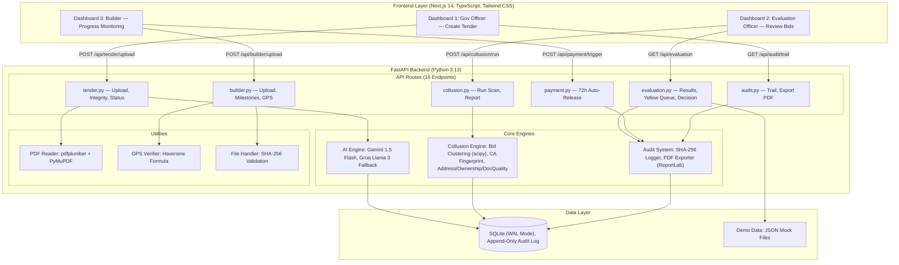
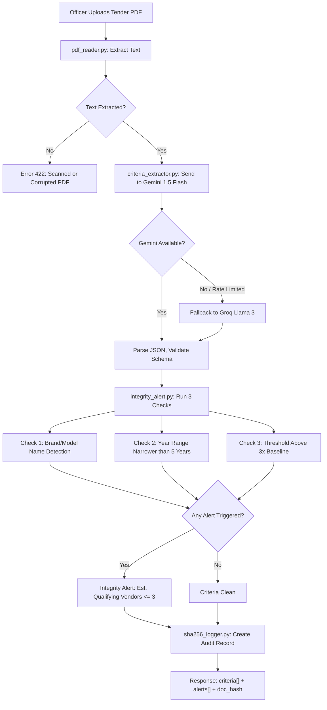
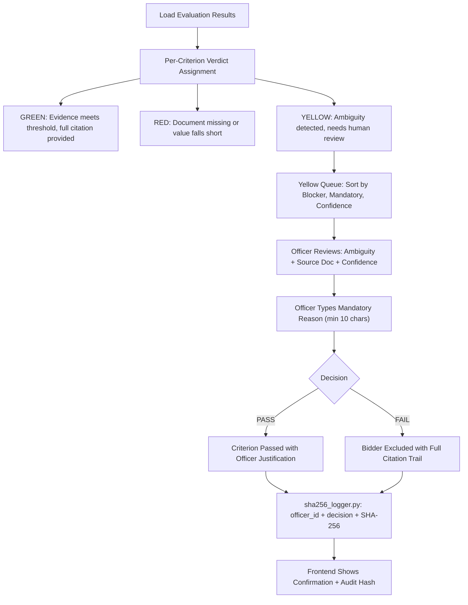
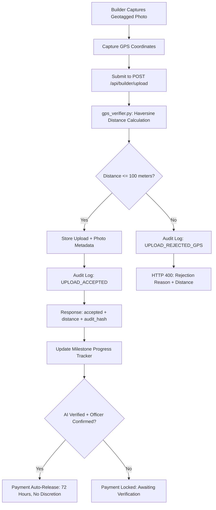
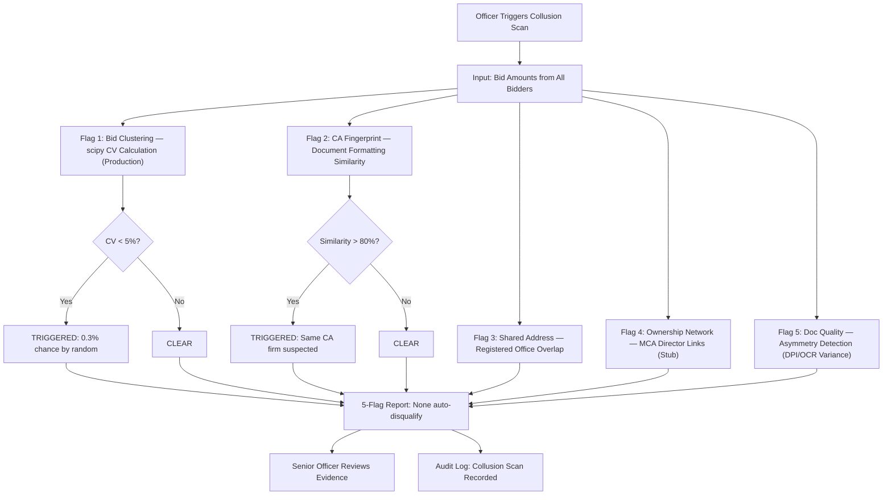
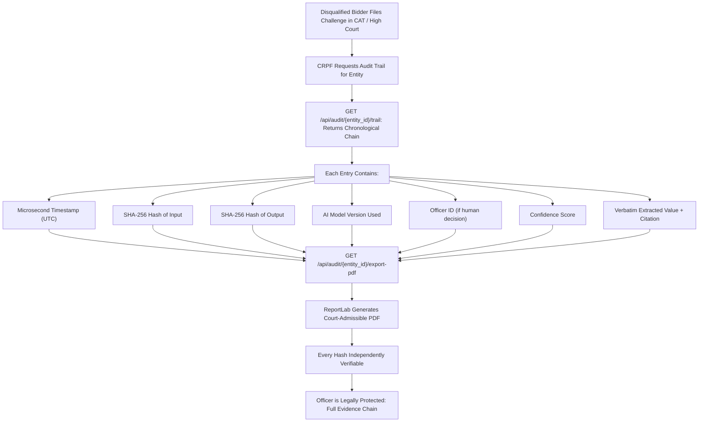

# Nyayadarsi

**AI-Powered Procurement Justice Platform**

*Nyayadarsi (Sanskrit: one who sees justice) is a full-stack AI system that detects and prevents corruption in Indian government procurement — before any money moves.*

<p align="center">
  
  
  
  
  
  
  
  
  
</p>

---

**Event:** PAN IIT AI for Bharat Hackathon — Grand Finale, May 16, 2026  
**Theme:** AI-Based Tender Evaluation for CRPF  
**Team:** Coding Aghoris  

**Stack:** FastAPI, Next.js 14, TypeScript (strict), Tailwind CSS, Gemini 1.5 Flash, SQLite  

---

## Problem Statement

Indian government procurement is vulnerable to corruption at five specific points. Nyayadarsi addresses all five with automated, auditable countermeasures.

| Point | Attack Vector | Current Vulnerability | Nyayadarsi Countermeasure |
|-------|--------------|----------------------|--------------------------|
| 1 | L1 Trap | Tender criteria engineered so only one vendor qualifies | Real-time integrity alerts before tender publication |
| 2 | Document Fraud | Forged certificates pass manual evaluation | AI-powered document verification with GREEN/YELLOW/RED verdicts |
| 3 | Cartel Bidding | Shell companies simulate competition with near-identical bids | 5-flag collusion risk engine (bid clustering, CA fingerprint, address overlap) |
| 4 | Ghost Work | Bills cleared for work never completed | GPS-verified daily uploads with distance threshold enforcement |
| 5 | Payment Extortion | Commissions extracted at every payment stage | 72-hour deterministic auto-release with zero officer timing discretion |

---

## Architecture



---

## Core Workflows

### 1. Tender Upload, AI Extraction, and Integrity Alerts



### 2. Bidder Evaluation, Officer Decision, and Audit Logging



### 3. Builder GPS Upload and Verification



### 4. Collusion Risk Scan (5-Flag Analysis)



### 5. Audit Trail and Court-Admissible PDF Export



---

## Project Structure

```
nyayadarsi/
|
|-- .env.example                       # Environment variable template
|-- .gitignore
|-- README.md
|-- worktillnow.md                     # Development progress tracker
|-- LICENSE                            # MIT License
|
|-- backend/                           # FastAPI (Python 3.13)
|   |-- __init__.py
|   |-- main.py                        # App entry: router mounting, CORS, health check
|   |-- config.py                      # Environment loader: API keys, GPS coords, thresholds
|   |-- database.py                    # SQLite (WAL mode): 6 tables, init_db()
|   |-- requirements.txt
|   |
|   |-- core/                          # Infrastructure
|   |   |-- config.py                  # Pydantic BaseSettings for env management
|   |   |-- database.py                # SQLAlchemy session management, connection pooling
|   |   |-- security.py                # JWT lifecycle, cryptographic operations
|   |   +-- dependencies.py            # Authentication dependency injection
|   |
|   |-- ai/                           # AI Pipeline
|   |   |-- gemini_client.py           # Gemini 1.5 Flash with rate-limit retry
|   |   |-- groq_client.py            # Groq Llama 3 seamless fallback
|   |   |-- criteria_extractor.py      # Tender text to structured criteria JSON
|   |   |-- integrity_alert.py         # Rule-based alert engine (brand, year, threshold)
|   |   |-- value_extractor.py         # Document value extraction
|   |   |-- financial_ontology.py      # Synonym mapping ("Annual Turnover" = "Net Revenue")
|   |   +-- consistency_checker.py     # Cross-document financial verification
|   |
|   |-- collusion/                     # Collusion Risk Engine
|   |   |-- bid_clustering.py          # scipy CV analysis (5% threshold)
|   |   |-- ca_fingerprint.py          # Document formatting similarity
|   |   |-- address_flag.py            # Shared registered office detection
|   |   |-- ownership_network.py       # MCA director links (Phase 2 stub)
|   |   +-- doc_quality.py             # Quality asymmetry detection
|   |
|   |-- audit/                         # Cryptographic Audit System
|   |   |-- sha256_logger.py           # SHA-256 hashing, append-only INSERT
|   |   +-- pdf_exporter.py            # Court-admissible PDF (ReportLab)
|   |
|   |-- schemas/                       # Pydantic Schemas (Request/Response Validation)
|   |   |-- auth.py
|   |   |-- tender.py
|   |   |-- evaluation.py
|   |   |-- collusion.py
|   |   |-- builder.py
|   |   +-- audit.py
|   |
|   |-- services/                      # Business Logic Layer
|   |   |-- auth_service.py
|   |   |-- tender_service.py
|   |   |-- evaluation_service.py
|   |   |-- collusion_service.py
|   |   |-- builder_service.py
|   |   |-- payment_service.py
|   |   +-- audit_service.py
|   |
|   |-- models/                        # SQLAlchemy ORM Models
|   |   |-- user.py
|   |   |-- tender.py
|   |   |-- bidder_evaluation.py
|   |   |-- builder_upload.py
|   |   |-- milestone.py
|   |   |-- collusion_report.py
|   |   +-- audit_log.py
|   |
|   |-- routes/                        # API Endpoints (16 total)
|   |   |-- tender.py                  # POST /upload, POST /integrity-check, GET /status
|   |   |-- evaluation.py              # GET /results, GET /yellow-queue, POST /officer-decision
|   |   |-- collusion.py               # POST /run, GET /report
|   |   |-- builder.py                 # POST /upload, GET /milestones, POST /verify-gps
|   |   |-- payment.py                 # POST /trigger (72h auto-release)
|   |   +-- audit.py                   # GET /trail, GET /all, GET /export-pdf
|   |
|   +-- utils/                        # Utility Modules
|       |-- pdf_reader.py              # pdfplumber with PyMuPDF fallback
|       |-- gps_verifier.py            # Haversine formula (100m threshold)
|       +-- file_handler.py            # Upload validation + SHA-256
|
|-- frontend/                          # Next.js 14 (TypeScript, Strict Mode)
|   |-- tsconfig.json                  # Strict mode, path aliases (@/)
|   |-- next-env.d.ts
|   |-- package.json
|   |-- next.config.js                 # API proxy to FastAPI backend
|   |-- tailwind.config.js             # Custom palette, verdict colors, animations
|   |-- postcss.config.js
|   |
|   |-- types/                         # TypeScript Interfaces (mirrors backend schemas)
|   |   |-- api.ts                     # ApiResponse<T>, ApiError
|   |   |-- auth.ts                    # User, LoginRequest, TokenResponse
|   |   |-- tender.ts                  # TenderCriterion, IntegrityAlertResponse
|   |   |-- evaluation.ts              # Verdict, CriterionResult, BidderEvaluation
|   |   |-- collusion.ts               # CollusionFlag, CollusionReportResponse
|   |   |-- builder.ts                 # Milestone, MilestoneData, PaymentResponse
|   |   |-- audit.ts                   # AuditEntry, AuditTrailResponse
|   |   +-- index.ts                   # Barrel export
|   |
|   |-- services/                      # Centralized API Client
|   |   |-- apiClient.ts               # Typed fetch wrapper with auth token injection
|   |   |-- authService.ts             # Login, register, token management (sessionStorage)
|   |   |-- tenderService.ts           # uploadTender(), checkIntegrity()
|   |   |-- evaluationService.ts       # getEvaluationResults(), postOfficerDecision()
|   |   |-- collusionService.ts        # runCollusionScan(), getCollusionReport()
|   |   |-- builderService.ts          # uploadBuilderPhoto(), triggerPayment()
|   |   |-- auditService.ts            # getAuditTrail(), healthCheck()
|   |   +-- index.ts                   # Barrel export
|   |
|   |-- hooks/                         # Custom React Hooks
|   |   |-- useApi.ts                  # Generic data fetching with loading/error/refetch
|   |   |-- useAuth.ts                 # Auth context consumer
|   |   |-- useTender.ts              # Upload state, integrity checking
|   |   |-- useEvaluation.ts           # Parallel eval + yellow queue fetch, collusion scan
|   |   +-- useBuilder.ts             # Memoized milestone aggregations
|   |
|   |-- store/                         # State Management (React Context + useReducer)
|   |   |-- AuthContext.tsx            # JWT session management, auto-restore on mount
|   |   +-- NotificationContext.tsx    # Toast notifications with auto-dismiss
|   |
|   |-- constants/                     # Typed Constants
|   |   +-- index.ts                   # NavItems, VerdictColors, FlagLabels (as const)
|   |
|   |-- utils/                         # Utilities
|   |   +-- sanitize.ts               # XSS prevention: strips script/iframe/onclick patterns
|   |
|   |-- components/
|   |   |-- layout/
|   |   |   +-- Layout.tsx             # Application shell: sidebar, top bar, ARIA labels
|   |   |-- ui/                        # Reusable Primitives (all React.memo)
|   |   |   |-- VerdictBadge.tsx       # GREEN/YELLOW/RED badge
|   |   |   |-- ConfidenceBar.tsx      # Color-coded progress bar
|   |   |   |-- StatCard.tsx           # Glassmorphic stat display
|   |   |   |-- LoadingSpinner.tsx     # SVG animated spinner
|   |   |   |-- ErrorMessage.tsx       # Styled error display
|   |   |   |-- Toast.tsx              # Notification toast
|   |   |   +-- ErrorBoundary.tsx      # Catches uncaught errors with retry
|   |   |-- tender/                    # Tender Domain Components
|   |   |   |-- UploadZone.tsx         # Drag-and-drop PDF upload with keyboard accessibility
|   |   |   |-- CriterionCard.tsx      # Single criterion display with type badges
|   |   |   |-- IntegrityAlert.tsx     # Alert with revise/override + input sanitization
|   |   |   +-- ManualCheckForm.tsx    # Real-time criterion integrity checker
|   |   |-- evaluation/                # Evaluation Domain Components
|   |   |   |-- VerdictRow.tsx         # Criterion result with citations
|   |   |   |-- YellowItem.tsx         # Officer decision form with audit logging
|   |   |   |-- BidderList.tsx         # Selectable bidder panel
|   |   |   +-- CollusionPanel.tsx     # Slide-in 5-flag analysis panel
|   |   +-- builder/                   # Builder Domain Components
|   |       |-- MilestoneCard.tsx      # Progress bars, payment controls
|   |       +-- GPSUploadSection.tsx   # GPS coordinate input with distance validation
|   |
|   |-- pages/                         # Next.js Pages (thin orchestrators)
|   |   |-- _app.tsx                   # Root: AuthProvider, NotificationProvider, ErrorBoundary
|   |   |-- index.tsx                  # Landing: animated logo, navigation cards, auto-redirect
|   |   |-- gov.tsx                    # Dashboard 1: tender upload, AI extraction, alerts
|   |   |-- evaluation.tsx             # Dashboard 2: bidder verdicts, yellow queue, collusion
|   |   +-- builder.tsx               # Dashboard 3: GPS uploads, milestones, payments
|   |
|   +-- styles/
|       +-- globals.css                # Design system: glassmorphism, animations, verdict badges
|
|-- demo/                             # Demonstration Assets
|   |-- sample_tender_text.txt         # CRPF barracks tender with narrow criteria
|   +-- mock_data/
|       |-- evaluation_results.json    # 4 bidders with GREEN, RED, YELLOW verdicts
|       |-- collusion_results.json     # 5 flags: bid clustering + CA fingerprint triggered
|       |-- bids.json                  # 4 bid amounts for clustering analysis
|       |-- milestones.json            # 5 construction milestones
|       +-- audit_trail.json           # Sample audit entries with SHA-256 hashes
|
+-- scripts/                          # Setup and Utilities
    |-- setup.bat                      # Windows one-click setup
    |-- seed_demo.py                   # Load mock data into database
    +-- test_gemini.py                 # Validate API key before demo
```

---

## Quick Start

### Prerequisites

- Python 3.11 or later (tested with 3.13)
- Node.js 18 or later
- Gemini API Key (obtain from https://aistudio.google.com/app/apikey)

### 1. Clone and Configure

```bash
git clone https://github.com/Satya37x1112/Nyayadarsi.git
cd Nyayadarsi

# Create environment file from template
cp .env.example .env
# Edit .env and add your GEMINI_API_KEY
```

### 2. Backend Setup

```bash
cd backend
python -m venv venv

# Activate virtual environment
source venv/bin/activate          # Linux / macOS
venv\Scripts\activate             # Windows

pip install -r requirements.txt

# Initialize database and seed demo data
cd ..
python scripts/seed_demo.py
```

### 3. Frontend Setup

```bash
cd frontend
npm install
```

### 4. Run

```bash
# Terminal 1: Start backend (from project root)
python -m uvicorn backend.main:app --reload --host 0.0.0.0 --port 8000

# Terminal 2: Start frontend
cd frontend
npm run dev
```

| Service | URL |
|---------|-----|
| Frontend | http://localhost:3000 |
| Backend API | http://localhost:8000 |
| API Documentation (Swagger) | http://localhost:8000/docs |
| API Documentation (ReDoc) | http://localhost:8000/redoc |

### 5. Verify

```bash
# Test API health
curl http://localhost:8000/api/health

# Validate AI connection
python scripts/test_gemini.py

# Run TypeScript type checking
cd frontend && npx tsc --noEmit
```

---

## API Reference

### Tender Management

| Method | Endpoint | Description |
|--------|----------|-------------|
| POST | `/api/tender/upload` | Upload tender PDF; Gemini extracts criteria and generates integrity alerts |
| POST | `/api/tender/integrity-check` | Check a single criterion text for integrity violations |
| GET | `/api/tender/{tender_id}/status` | Retrieve tender evaluation progress |

### Bid Evaluation

| Method | Endpoint | Description |
|--------|----------|-------------|
| GET | `/api/evaluation/{tender_id}/results` | All bidder evaluations with GREEN/YELLOW/RED verdicts |
| GET | `/api/evaluation/{tender_id}/yellow-queue` | Pending YELLOW items sorted by consequence (blocker, mandatory, confidence) |
| POST | `/api/evaluation/officer-decision` | Record officer PASS/FAIL with mandatory written reason |

### Collusion Detection

| Method | Endpoint | Description |
|--------|----------|-------------|
| POST | `/api/collusion/run` | Execute 5-flag collusion analysis (scipy-based) |
| GET | `/api/collusion/{tender_id}/report` | Retrieve stored collusion report |

### Builder Monitoring

| Method | Endpoint | Description |
|--------|----------|-------------|
| POST | `/api/builder/upload` | GPS-verified progress upload (rejects if distance exceeds 100m) |
| GET | `/api/builder/{contract_id}/milestones` | Milestone progress and payment status |
| POST | `/api/builder/verify-gps` | Standalone GPS distance check |

### Payment and Audit

| Method | Endpoint | Description |
|--------|----------|-------------|
| POST | `/api/payment/trigger` | Trigger 72-hour deterministic auto-release payment |
| GET | `/api/audit/{entity_id}/trail` | Full chronological audit chain for any entity |
| GET | `/api/audit/all` | All audit entries (limit 1000) |
| GET | `/api/audit/{entity_id}/export-pdf` | Court-admissible PDF download |

---

## Technology Stack

| Layer | Technology | Rationale |
|-------|-----------|-----------|
| AI (Primary) | Gemini 1.5 Flash | Free tier (1M tokens/day), data sovereignty compliant |
| AI (Fallback) | Groq + Llama 3 8B | Ultra-fast fallback when Gemini is rate-limited |
| Backend | FastAPI + Python 3.13 | Async, auto-generated docs, Pydantic validation |
| Database | SQLite (WAL mode) | Zero-config, append-only audit capability |
| ORM | SQLAlchemy | Session management, connection pooling, schema versioning |
| Authentication | JWT (PyJWT) | Stateless auth with role-based access control |
| PDF Processing | pdfplumber + PyMuPDF | Digital PDFs + complex layout fallback |
| Statistics | scipy + numpy | Real bid clustering coefficient of variation |
| Audit Hashing | hashlib SHA-256 | Python stdlib, no external dependencies |
| PDF Export | ReportLab | Court-admissible document generation |
| Frontend | Next.js 14 + React 18 | SSR, API proxy, rapid development |
| Type System | TypeScript (strict mode) | Full type safety mirroring backend Pydantic schemas |
| Styling | Tailwind CSS 3 | Utility-first with custom design system |
| State Management | React Context + useReducer | Lightweight, zero-dependency global state |
| GPS | Haversine Formula | Real distance math, zero dependencies |

**Data Sovereignty:** GPT-4 and all non-Gemini cloud LLMs are excluded. Gemini operates in extractive mode only — it quotes verbatim from documents and never generates or guesses values. This is non-negotiable for CRPF deployment.

---

## Implementation Status

### Production (Working Code)

| Feature | Implementation |
|---------|---------------|
| Tender PDF to Criteria JSON | Gemini 1.5 Flash extraction pipeline |
| Integrity Alerts | Rule-based regex (brands, year ranges, threshold extremity) |
| SHA-256 Audit Logging | Python hashlib, append-only INSERT to SQLite |
| GPS Verification | Haversine formula, 100m threshold, server-side validation |
| Bid Clustering | scipy coefficient of variation, 5% threshold |
| Court-Admissible PDF | ReportLab with all hashes and timestamps |
| JWT Authentication | PyJWT with role-based access control (RBAC) |
| Typed API Client | TypeScript generic wrapper with auth header injection |
| Input Sanitization | XSS prevention on all user text before API submission |

### Smart Mocks (Pre-computed Realistic Data)

| Feature | Implementation | Reason |
|---------|---------------|--------|
| GREEN/YELLOW/RED Verdicts | Loaded from `evaluation_results.json` | Full document evaluation requires LayoutLMv3 (Phase 2) |
| CA Fingerprint | Pre-set 91% for known demo pairs | Real n-gram comparison requires document corpus |
| Ownership Network | Returns honest stub | MCA API requires NIC coordination |
| AI Progress Estimation | Hardcoded percentage | YOLOv8 site analysis is Phase 2 |

---

## Audit Trail

Every action generates an immutable record:

```
AUDIT RECORD
-----------------------------------------------------------
Timestamp:        2026-05-02T10:15:30.456789Z
Action:           OFFICER_DECISION
Entity:           CRPF-2025-CONST-001:BID_003
SHA-256 Input:    f8071d46e93ab123567890...
SHA-256 Output:   09182e57fa4bc234678901...
Model Version:    gemini-1.5-flash (if AI action)
Officer ID:       OFF_002 (if human decision)
Confidence:       0.61
Verdict:          PASS
-----------------------------------------------------------

- Append-only. No UPDATE. No DELETE.
- Every hash is independently verifiable.
- Exportable as court-admissible PDF for CAT/High Court proceedings.
```

---

## Three Dashboards

### Dashboard 1: Government Officer (Create Tender)
- Upload existing tender PDF; Gemini AI extracts all eligibility criteria
- Real-time integrity alerts fire on narrow or restrictive criteria
- Manual criterion check with instant alert feedback
- Override requires mandatory documented justification (input sanitized)

### Dashboard 2: Evaluation Officer (Review Bids)
- Bidder list with overall GREEN/YELLOW/RED verdict badges
- Click any bidder for criterion-by-criterion breakdown with citations
- Yellow queue shows pending items ranked by consequence (blocker, mandatory, confidence)
- Officer decision requires mandatory reasoning (minimum 10 characters)
- Collusion risk scan slide-in panel with 5-flag analysis

### Dashboard 3: Builder (Progress Monitoring)
- GPS-verified daily uploads (100m threshold, server-side Haversine validation)
- Milestone tracker with progress bars and payment status
- Payment auto-releases 72 hours after AI verification + officer confirmation
- Contract details and overall progress statistics

---

## Security

| Measure | Implementation |
|---------|---------------|
| Authentication | JWT tokens with role-based access control |
| Token Storage | `sessionStorage` (cleared on tab close, mitigates XSS-based theft) |
| Auth Header Injection | Centralized in `apiClient.ts`, every request includes `Authorization: Bearer` |
| Input Sanitization | `sanitizeText()` strips `<script>`, `<iframe>`, `onclick`, `javascript:` patterns |
| Rendering Safety | Zero instances of `dangerouslySetInnerHTML` in the codebase |
| Data Sovereignty | AI operates in extractive mode only, no data leaves Gemini API boundaries |

---

## Team

**Coding Aghoris** — PAN IIT AI for Bharat Hackathon, Grand Finale 2026

| Member | Role |
|--------|------|
| Satya Sarthak Manohari | Full-Stack Development, System Architecture |
| Sibam Prasad Sahoo | Backend Development |
| Suryansh Anand | Development |
| Pritam | Development |

---

## License

MIT License. See [LICENSE](LICENSE) for details.

Copyright (c) 2026 Satya Sarthak Manohari, Sibam Prasad Sahoo, Suryansh Anand, Pritam

---

**Nyayadarsi — AI that sees justice**  
nyaya-darshi.vercel.app
